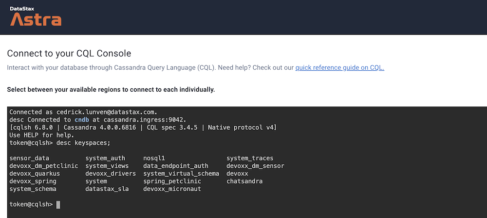
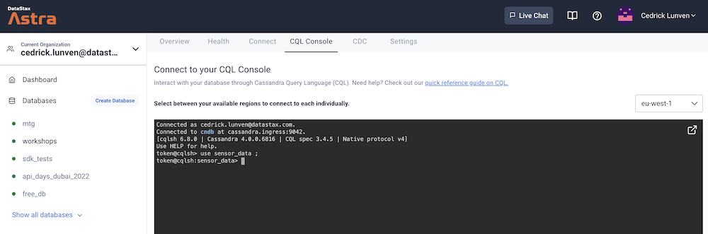
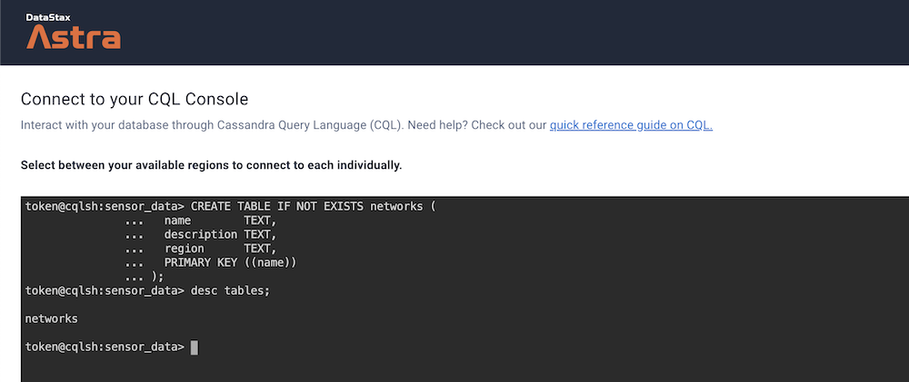
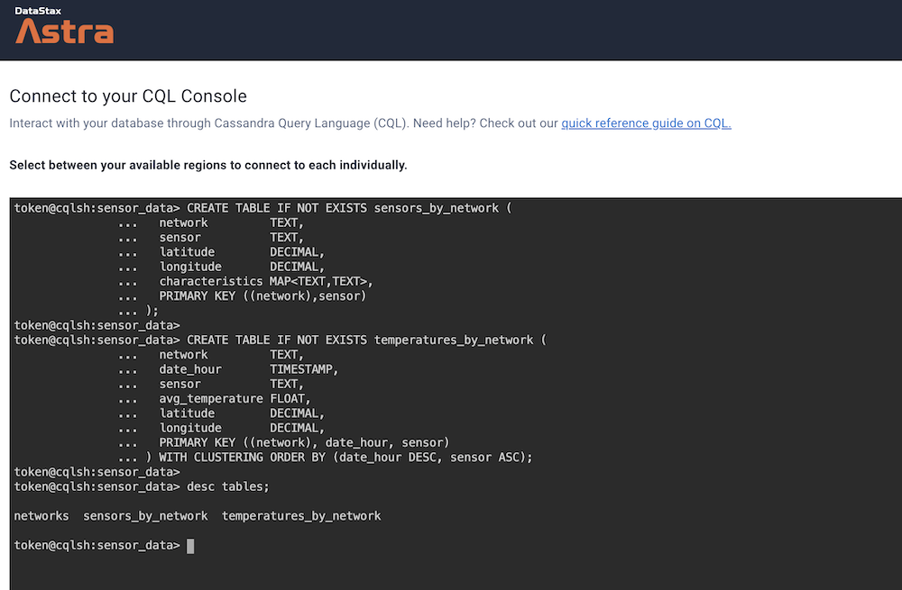
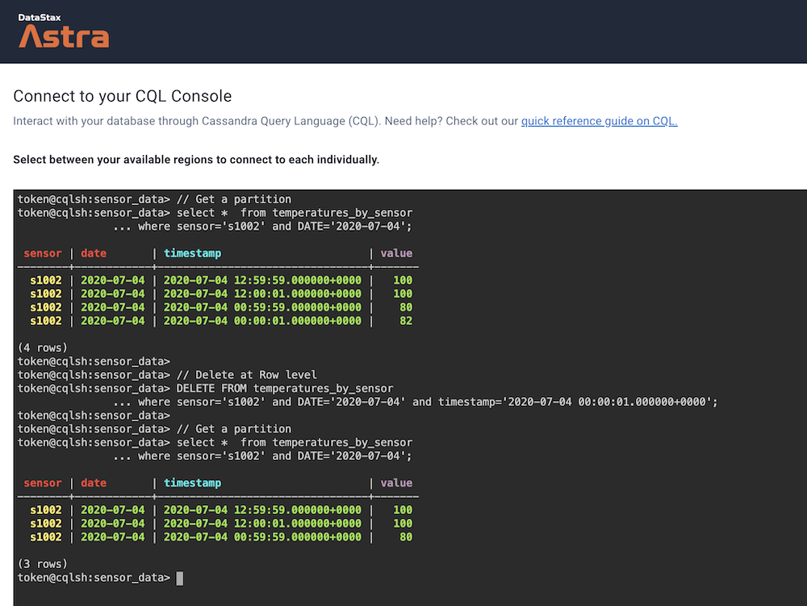

# 🎓 Apache Cassandra™ Fundamentals

Welcome to the 'Apache Cassandra™ Fundamentals' workshop! In this two-hour workshop, we shows the most important fundamentals and basics of the powerful distributed NoSQL database Apache Cassandra. 

Using **Astra DB**, the cloud based _Cassandra-as-a-Service_ platform delivered by DataStax, we will cover the very first steps for every developer who wants to try to learn a new database: creating tables and CRUD operations. 

It doesn't matter if you join our workshop live or you prefer to do at your own pace, we have you covered. In this repository, you'll find everything you need for this workshop:

> [🔖 Accessing HANDS-ON](#-start-hands-on)

## 📋 Table of content


1. [Objectives](#1-objectives)
2. [Frequently asked questions](#2-frequently-asked-questions)
3. [Materials for the Session](#3-materials-for-the-session)
4. [Create your Database](#4-create-astra-db-instance)
5. [Create tables](#5-create-tables)
6. [Execute CRUD operations](#6-execute-crud-operations)
7. [Homerworks](#7-homerworks)
8. [What's NEXT ](#8-what-s-next)

<p><br/>

## 1. Objectives

1️⃣ Give you an understanding and how and where to positionned Apache Cassandra™

2️⃣ Give an overview of the NoSQL ecosystem and its rationale

3️⃣ Provide an overview of Cassandra Architecture

4️⃣ Make you create your first tables and statements

🚀 Have fun with an interactive session

## 2. Frequently asked questions

<p/>
<details>
<summary><b> 1️⃣ Can I run this workshop on my computer?</b></summary>
<hr>
<p>There is nothing preventing you from running the workshop on your own machine, If you do so, you will need the following
<ol>
<li><b>git</b> installed on your local system
<li><b>JDK 8+</b> installed on your local system
<li><b>Maven 3.6+</b> installed on your local system
</ol>
</p>
In this readme, we try to provide instructions for local development as well - but keep in mind that the main focus is development on Gitpod, hence <strong>We can't guarantee live support</strong> about local development in order to keep on track with the schedule. However, we will do our best to give you the info you need to succeed.
</details>
<p/>
<details>
<summary><b> 2️⃣ What other prerequisites are required?</b></summary>
<hr>
<ul>
<li>You will need an enough *real estate* on screen, we will ask you to open a few windows and it does not file mobiles (tablets should be OK)
<li>You will need a GitHub account eventually a google account for the Google Authentication (optional)
<li>You will need an Astra account: don't worry, we'll work through that in the following
<li>As Intermediate level we expect you to know what java and Spring are. 
</ul>
</p>
</details>
<p/>
<details>
<summary><b> 3️⃣ Do I need to pay for anything for this workshop?</b></summary>
<hr>
<b>No.</b> All tools and services we provide here are FREE. FREE not only during the session but also after.
</details>
<p/>
<details>
<summary><b> 4️⃣ Will I get a certificate if I attend this workshop?</b></summary>
<hr>
Attending the session is not enough. You need to complete the homeworks detailed below and you will get a nice badge that you can share on linkedin or anywhere else *(open api badge)*
</details>
<p/>

## 3. Materials for the Session

It doesn't matter if you join our workshop live or you prefer to work at your own pace,
we have you covered. In this repository, you'll find everything you need for this workshop:

- [Slide deck](/slides/slides.pdf)
- [Discord chat](https://dtsx.io/discord)
- [Questions and Answers](https://community.datastax.com/)
- [Twitch backup](https://www.twitch.tv/datastaxdevs)

----

# 🏁 Start Hands-on

## 4. Create your Astra DB instance

_**`ASTRA DB`** is the simplest way to run Cassandra with zero operations at all - just push the button and get your cluster. No credit card required, 40M read/write operations and about 80GB storage monthly for free - sufficient to run small production workloads. If you end your credits the databases will shut down, no charge_

Leveraging [Database creation guide](https://github.com/datastaxdevs/awesome-astra/wiki/Create-an-AstraDB-Instance) create a database. *Right-Click the button* with *Open in a new TAB.*

<a href="https://astra.dev/2-16"></a>

|Field|Value|
|---|---|
|**Database Name**| `workshops`|
|**Keyspace Name**| `sensor_data`|
|**Regions**| Select `GOOGLE CLOUD`, then an Aria close to you, then a region with no LOCKER 🔒 icons, those are the region you can use for free.   |

> **ℹ️ Note:** If you already have a database `workshops`, simply add a keyspace `sensor_data` using the `Add Keyspace` button on the bottom right hand corner of db dashboard page.

While the database is being created, you will also get a **Security token**:
save it somewhere safe, as it will be needed to later access the database!
(In particular the string starting with `AstraCS:...`.)

The status will change from `Pending` to `Active` when the database is ready, this will only take 2-3 minutes. You will also receive an email when it is ready.

#### Walkthrough


[🏠 Back to Table of Contents](#-table-of-content)

## 5. Create tables

Ok, now that you have a database created the next step is to create tables to work with. 

> _General Methodology Notes_: We'll work with a (rather simplified) _Internet of things_ application where we recording temperatures coming for sensors.
> `networks`, identified by a unique name, are represented by several `sensors`.
> sensors are also uniquely identified by their name, such as `s1001`. The design of our application is such that we need to be able to (a) retrieve all `sensors` by a given `networks`, sorted by the sensor name,
> For each sensor you want to retrieve `temperaturs` for a given `network`, sorted by descending date and eventually filter for a `sensor`.
> As dictated by the best practices of data modeling with Cassandra, these requirements are satisfied by creating dedicated tables (denormalization),
> It will be our (that is, the application's) responsibility to maintain them aligned.
> Of course, we also need a `networks` table - we will start with this one indeed.

#### ✅ Step 5a. Navigate to the CQL Console and login to the database

In the Summary screen for your database, select **_CQL Console_** from the top menu in the main window. This will take you to the CQL Console and automatically log you in.

<details>
    <summary>Show me! </summary>
    
</details>

> _Note_: if you are working with your own Cassandra cluster (other than Astra DB), you will reach the CQL Console differently.
> Moreover, in that case you have to manually create the keyspace once in the CQL Console: this is done with a command similar to
> `CREATE KEYSPACE sensor_data WITH REPLICATION = {'class': 'NetworkTopologyStrategy', 'replication_factor': 3};`.
> See the Cassandra documentation for more details on this.

#### ✅ Step 5b. Describe keyspaces and USE one of them**

Ok, now we're ready to rock. Creating tables is quite easy, but before we create one we need to tell the database which keyspace we are working with.

First, let's **_DESCRIBE_** all of the keyspaces that are in the database. This will give us a list of the available keyspaces.

📘 **Command to execute**
```sql
DESC KEYSPACES;
```
_"desc" is short for "describe", either is valid._

> CQL commands usually end with a semicolon `;`. If you hit Enter, nothing happens and you don't even get your prompt back, most likely it's because you have not closed the command with `;`. If in trouble, you can always get back to the prompt with `Ctrl-C` and start typing the command anew.

📗 **Expected output**



> ℹ️ Depending on your setup you might see a different set of keyspaces than in the image. The one we care about for now is **_sensor_data_**. From here, execute the **_USE_** command with the **_sensor_data_** keyspace to tell the database our context is within **_sensor_data_**.

> Take advantage of the TAB-completion in the CQL Console. Try typing `use sens` and then pressing TAB, for example.

📘 **Command to execute**
```sql
USE sensor_data;
```

📗 **Expected output**



Notice how the prompt displays ```<username>@cqlsh:sensor_data>``` informing us we are **using** the **_sensor_data_** keyspace. Now we are ready to create our table.

#### ✅ Step 5c. Create the `networks` table**

At this point we can execute a command to create the **networks** table.
Just copy/paste the following command into your CQL console at the prompt.
Try to identify the primary key, the partition key and the clustering columns
(if any) for this table in the command:

📘 **Command to execute**

```sql
CREATE TABLE IF NOT EXISTS networks (
  name        TEXT,
  description TEXT,
  region      TEXT,
  PRIMARY KEY ((name))
);
```

Then **_DESCRIBE_** your keyspace tables to ensure it is there.

📘 **Command to execute**

```sql
DESC TABLES;
```
📗 **Expected output**



Aaaand **BOOM**, you created a table in your database. That's it.
Now let's go ahead and create a couple more tables before we do
something interesting with the data.

#### ✅ Step 5d. Create the tables for `sensors` and `temperatures`**

Let us create two more tables, which will contain the _posts_.
As remarked earlier, we will store the posts in two tables which
differ in how they are partitioned: look at the commands below,
the differences mostly lie in the `PRIMARY KEY` specification:

📘 **Command to execute**

```sql
CREATE TABLE IF NOT EXISTS sensors_by_network (
  network         TEXT,
  sensor          TEXT,
  latitude        DECIMAL,
  longitude       DECIMAL,
  characteristics MAP<TEXT,TEXT>,
  PRIMARY KEY ((network),sensor)
);

CREATE TABLE IF NOT EXISTS temperatures_by_network (
  network         TEXT,
  date_hour       TIMESTAMP,
  sensor          TEXT,
  avg_temperature FLOAT,
  latitude        DECIMAL,
  longitude       DECIMAL,
  PRIMARY KEY ((network), date_hour, sensor)
) WITH CLUSTERING ORDER BY (date_hour DESC, sensor ASC);


```

Then **_DESCRIBE_** your keyspace tables: you should see all three listed.

📘 **Command to execute**

```sql
DESC TABLES;
```

📗 **Expected output**



_You may wonder, how did we arrive at this particular structure for the `sensors_by_network` and `temperatures_by_network` tables? Also why those table names ?
The answer lies in the methodology for data modeling
with Cassandra, which, at its very core, states: **first look at the application's needs,
determine the required workflows, then map them to a number of queries, finally design a table around each query**.
We create table `sensors_by_network` to support a query such as "get all sensors by a network `X`";
then we also need table `temperatures_by_network` for a query of type "get all temperature value for a network `Y`, and filter with a sensor `W`"._

[🏠 Back to Table of Contents](#table-of-contents)

## 6. Execute CRUD operations

CRUD stands for "**create, read, update, and delete**". Simply put, they are the basic types of commands you need to work with ANY database in order to maintain data for your applications.

#### ✅ Step 6a. (C)RUD = create = insert data, users**

Our tables are in place so let's put some data in them. This is done with the **INSERT** statement. We'll start by inserting three rows into the **_networks_** table.

Copy and paste the following in your CQL Console:
_(Once you have carefully examined the first of the following **INSERT** statements below, you can simply copy/paste the others which are very similar.)_

📘 **Commands to execute**

```sql
INSERT INTO networks (name,description,region)
VALUES ('forest-net',
        'forest fire detection network',
        'south');

INSERT INTO networks (name,description,region)
VALUES ('volcano-net',
        'volcano monitoring network',
        'north');   
```

#### ✅ Step 6b. (C)RUD = create = insert data, posts**

Let's run some more **INSERT** statements, this time for **sensors**. We'll insert data into the **_sensors_by_network_** table.
_(Once you have carefully examined the first of the following **INSERT** statements below, you can simply copy/paste the others which are very similar.)_

> _Note_: in the following, we are using `MAP<>` where you can defined you our key/value adding a bit of flexibility where Cassandra Data models are strongly typed.

📘 **Commands to execute**

```sql
INSERT INTO sensors_by_network 
(network,sensor,latitude,longitude,characteristics)
VALUES ('forest-net','s1001',30.526503,-95.582815,
       {'accuracy':'medium','sensitivity':'high'});
INSERT INTO sensors_by_network 
(network,sensor,latitude,longitude,characteristics)
VALUES ('forest-net','s1002',30.518650,-95.583585,
       {'accuracy':'medium','sensitivity':'high'});     
INSERT INTO sensors_by_network 
(network,sensor,latitude,longitude,characteristics)
VALUES ('forest-net','s1003',30.515056,-95.556225,
       {'accuracy':'medium','sensitivity':'high'});     
INSERT INTO sensors_by_network 
(network,sensor,latitude,longitude,characteristics)
VALUES ('volcano-net','s2001',44.460321,-110.828151,
       {'accuracy':'high','sensitivity':'medium'});    
INSERT INTO sensors_by_network 
(network,sensor,latitude,longitude,characteristics)
VALUES ('volcano-net','s2002',44.463195,-110.830124,
       {'accuracy':'high','sensitivity':'medium'});    
```

Ok, we have a lovely bunch of sensors in our application.

Now let's add temperatures measures in table **_temperatures_by_network_** as well! Let's do it with the following command (please note that the `INSERT` statements are exactly the same as above, with only the table name changed):

> _Note_: In a relational database you may have use a join on 3 tables `Networks > Sensors > Temperatures`. in the following, we are putting back the network name in temperature table and this is because it will be required in the where clause. If the network is not required we could have use 

📘 **Commands to execute**

```sql

```

#### ✅ Step 6c. C(R)UD = read = read data**

Now that we've inserted a set of rows (two sets, to be precise), let's take a look at how to read the data back out. This is done with a **SELECT** statement. In its simplest form we could just execute a statement like the following **_**cough_** **_**cough_**:
```sql
// Read all rows from "posts_by_user" table (careful with this ...)
SELECT * FROM posts_by_user;
```

You may have noticed my coughing fit a moment ago. Even though you can execute a **SELECT** statement with no partition key defined, this is NOT something you should do when using Apache Cassandra. We are doing it here for illustration purposes only and because our whole dataset is just a handful of values.
Given the data we inserted earlier, a more proper statement would be something like (while we are at it, we also explicitly specify which columns we want back):
```sql
// Read (some columns of) rows in a certain partition of "posts_by_user" table
SELECT post_id, room_id, text FROM posts_by_user
  WHERE user_id = 11111111-1111-1111-1111-111111111111;
```

The key is to ensure we are **always selecting by some partition key** at a minimum, so to avoid the dreaded _full-cluster scans_ which yield performances that are generally unacceptable in production.

Ok, with that out of the way we can **READ** the data from the other table as well - remember we **INSERT**ed on both tables?

📘 **Commands to execute**

```sql
// Read the whole "posts_by_room" table
// (warning: not suitable for large tables in production)
SELECT * FROM posts_by_room;

// Read (some columns of) posts from a certain room (= a certain partition)
SELECT user_id, text FROM posts_by_room WHERE room_id = '#hiking';
```

(again, in the second **SELECT** we specify some columns - it is something we may want to do in most cases).

📗 **Expected output**


_Notice how the two tables contain the same set of posts, but group them differently:
table `posts_by_user` is partitioned by user, while table `posts_by_room` is partitioned by room - and the corresponding outputs
reflect this fact.
This is very much related to the fact that these two tables, in the data modeling process, were designed
to answer two different questions, "what are the posts by user X?" and "what are the posts in room Y?" respectively.
Moreover, within any partition in both tables, right as we required when creating the table,
posts are kept (and displayed) sorted by decreasing `post_id` (which, due to the nature of `TIMEUUID`s,
implies a time-ordering as well)._

Once you execute the above **SELECT** statements you should see something like the expected output above. We have now **READ** the data we **INSERTED** earlier. Awesome job!

_BTW, just a little extra for those who are interested. Since we used a [TIMEUUID](https://docs.datastax.com/en/cql-oss/3.3/cql/cql_reference/timeuuid_functions_r.html) type for our **post_id** field we can use the **dateOf()** function to determine the timestamp from the value. Check it out._

```sql
// Read all data from the posts_by_room table, 
// convert post_id into a timestamp, and label the column "post_date"
SELECT user_id, dateOf(post_id) AS post_date, text FROM posts_by_room
  WHERE room_id = '#hiking';
```

#### ✅ Step 6d. CR(U)D = update = update data**

At this point we've **_CREATED_** and **_READ_** some data, but what happens when you want to change some existing data to some new value? That's where **UPDATE** comes into play.
_The use case is as follows: in our chat app, users are allowed to edit their previous posts._

Let's take one of the records we created earlier and modify it. Recall that we **_INSERTED_** the following record in the **_posts_by_user_** table.
```sql
      // ** Just for reference: **
      //  INSERT INTO posts_by_user (user_id, post_id, room_id, text) VALUES (
      //    11111111-1111-1111-1111-111111111111,
      //    aaaaaaaa-5cff-11ec-be16-1fedb0dfd057,
      //    '#hiking', '... and Mt. Gumbo was easy!!!'
      //  );
```

Let's also take a look at how the **_posts_by_user_** table was created. In order to **UPDATE** an existing record, indeed, we need to know the primary key we defined when we **CREATE**d the table.
```sql
      // ** Just for reference: **
      // CREATE TABLE IF NOT EXISTS posts_by_user ( 
      //   user_id     UUID, 
      //   post_id     TIMEUUID,
      //   room_id     TEXT, 
      //   text        TEXT,
      //   PRIMARY KEY ((user_id), post_id)
      // ) WITH CLUSTERING ORDER BY (post_id DESC);
```

> Let's say that user "111..." has noticed the remark by "555..." and, perhaps a bit ashamed by their own boasting, wants to correct their assessment on the hike difficulty!

Looking at ```PRIMARY KEY ((user_id), post_id)```, we know that both **user_id** and **post_id** are used to define uniqueness of the row.
We'll need both to update our record (plus, of course, some of the data columns, otherwise we are not changing anything in that row!).

_You may remember that we used hardcoded values for **post_id** when we created these records (a real application would generate them live, one way or the other).
Imagine the UX for editing an existing post: when the user clicks the "edit" button, both **user_id** and **post_id** are known and can be provided to
the backend, where they ultimately become part of an **UPDATE** statement._

So we can run the following **UPDATE** statement and help user "111..." fix their post on table **_posts_by_user_**
(we also subsequently read back the data as a check):

📘 **Commands to execute**

```sql
UPDATE posts_by_user 
  SET text = '... and Mt. Gumbo was NOT SO easy!!!' 
    WHERE user_id = 11111111-1111-1111-1111-111111111111
    AND   post_id = aaaaaaaa-5cff-11ec-be16-1fedb0dfd057;

SELECT post_id, room_id, text FROM posts_by_user
  WHERE user_id = 11111111-1111-1111-1111-111111111111;
```

📗 **Expected output**


But **wait**: data, again, is denormalized! This means that we have to make sure
such an edit is performed on table **_posts_by_room_** as well.
Since the primary key of that table is given as `PRIMARY KEY ((room_id), post_id)`,
these are the fields to provide, along with `text` itself, to the **UPDATE** statement.

And we _could_ run an **UPDATE**. But, lo and behold, in Cassandra **UPDATE**s
and **INSERT**s are (almost) the same, as a consequence of its architecture and
the way storage and write logic are structured. We can then update the row with
an **INSERT** statement like the following (note that we provide: primary key +
any field that we want to modify; and leave out the other, unchanged fields):

📘 **Commands to execute**
```sql
INSERT INTO posts_by_room (room_id, post_id, text) VALUES (
  '#hiking',
  aaaaaaaa-5cff-11ec-be16-1fedb0dfd057,
  '... and Mt. Gumbo was NOT SO easy!!!'
);

SELECT post_id, user_id, text FROM posts_by_room WHERE room_id = '#hiking';
```

That's it, we successfully edited a post (on both tables).
All that's left now is to **DELETE** some data.

#### ✅ Step 6e. CRU(D) = delete = remove data**

The final operation from our **CRUD** acronym is **DELETE**. This is the operation we use when we want to remove data from the database.
In Apache Cassandra you can **DELETE** from the cell level all the way up to the partition
_(meaning I could remove a single column in a single row or I could remove a whole partition)_ using the same **DELETE** command.

_Generally speaking, it's best to perform as few delete operations as possible on the largest amount of data. Think of it this way, if you want to delete ALL data in a table, don't delete each individual cell, just **TRUNCATE** the table. If you need to delete all the rows in a partition, don't delete each row, **DELETE** the partition, and so on._

> User "555..." notices the post by "111..." being edited and wants to remove their snarky remark. Let's help them!

When deleting a row on a given table, we have to specify the values of the primary key for that table. And don't forget
that, in our data model, a post appears as two separate rows in the two tables, so we have to perform
two different **DELETE** operations!

📘 **Commands to execute**

```sql
SELECT post_id, room_id, text FROM posts_by_user
  WHERE user_id = 55555555-5555-5555-5555-555555555555;

SELECT post_id, user_id, text FROM posts_by_room WHERE room_id = '#hiking';

DELETE FROM posts_by_user
  WHERE user_id = 55555555-5555-5555-5555-555555555555
  AND post_id = bbbbbbbb-5cff-11ec-be16-1fedb0dfd057;

DELETE FROM posts_by_room
  WHERE room_id = '#hiking'
  AND post_id = bbbbbbbb-5cff-11ec-be16-1fedb0dfd057;

SELECT post_id, room_id, text FROM posts_by_user
  WHERE user_id = 55555555-5555-5555-5555-555555555555;

SELECT post_id, user_id, text FROM posts_by_room WHERE room_id = '#hiking';
```

(Notice in the above, for your convenience, we read the tables, then delete the rows, then read them again).

📗 **Expected output**



Notice the rows are now removed from both tables: it is as simple as that.

### Homework note

To submit the **homework**, please take a screenshot of the CQL Console showing the rows in tables
`posts_by_user` and `posts_by_room` before _and_ after executing the DELETE statements.

## 7. Homeworks


## 8. What's NEXT ?

We've just scratched the surface of what you can do using Astra DB, built on Apache Cassandra.
Go take a look at [DataStax for Developers](https://www.datastax.com/dev) to see what else is possible.
There's plenty to dig into!

Congratulations: you made to the end of today's workshop.

Don't forget to [submit your homework](https://dtsx.io/homework-intro-to-cassandra) and be awarded a nice verified badge!


**... and see you at our next workshop!**

> Sincerely yours, The DataStax Developers
