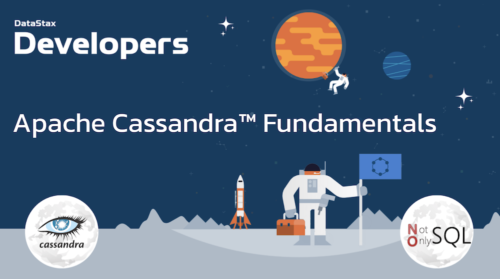
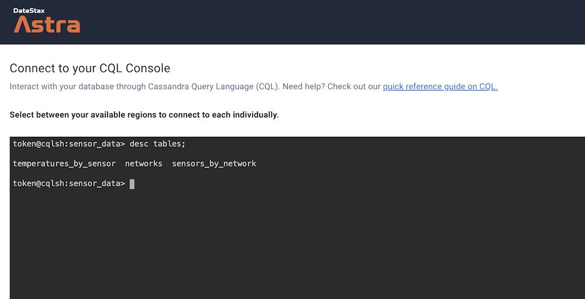

# 🎓 Apache Cassandra™ Fundamentals

Welcome to the **Apache Cassandra™ Fundamentals** workshop! In this two-hour workshop, we shows the most important fundamentals and basics of the powerful distributed `NoSQL database Apache Cassandra™`.

Using **Astra DB**, the cloud based _Cassandra-as-a-Service_ platform delivered by DataStax, we will cover the very first steps for every developer who wants to try to learn a new database: creating tables and CRUD operations. 



It doesn't matter if you join our workshop live or you prefer to do at your own pace, we have you covered. In this repository, you'll find everything you need for this workshop:

> [🔖 Accessing HANDS-ON](#-start-hands-on)

## 📋 Table of content


1. [Objectives](#1-objectives)
2. [Frequently asked questions](#2-frequently-asked-questions)
3. [Materials for the Session](#3-materials-for-the-session)
4. [Create your Database](#4-create-your-astra-db-instance)
5. [Create tables](#5-create-tables)
6. [Execute CRUD operations](#6-execute-crud-operations)
7. [Homeworks](#7-homeworks)
8. [What's NEXT ](#8-whats-next-)
<p><br/>

## 1. Objectives

1️⃣ **Give you an understanding and how and where to positionned Apache Cassandra™**

2️⃣ **Give an overview of the NoSQL ecosystem and its rationale**

3️⃣ **Provide an overview of Cassandra Architecture**

4️⃣ **Make you create your first tables and statements**

🚀 **Have fun with an interactive session**

## 2. Frequently asked questions

<p/>
<details>
<summary><b> 1️⃣ Can I run this workshop on my computer?</b></summary>
<hr>
<p>There is nothing preventing you from running the workshop on your own machine, If you do so, you will need the following
<ol>
<li><b>git</b> installed on your local system
<li><b>JDK 8+</b> installed on your local system
<li><b>Maven 3.6+</b> installed on your local system
</ol>
</p>
In this readme, we try to provide instructions for local development as well - but keep in mind that the main focus is development on Gitpod, hence <strong>We can't guarantee live support</strong> about local development in order to keep on track with the schedule. However, we will do our best to give you the info you need to succeed.
</details>
<p/>
<details>
<summary><b> 2️⃣ What other prerequisites are required?</b></summary>
<hr>
<ul>
<li>You will need an enough *real estate* on screen, we will ask you to open a few windows and it does not file mobiles (tablets should be OK)
<li>You will need a GitHub account eventually a google account for the Google Authentication (optional)
<li>You will need an Astra account: don't worry, we'll work through that in the following
<li>As Intermediate level we expect you to know what java and Spring are. 
</ul>
</p>
</details>
<p/>
<details>
<summary><b> 3️⃣ Do I need to pay for anything for this workshop?</b></summary>
<hr>
<b>No.</b> All tools and services we provide here are FREE. FREE not only during the session but also after.
</details>
<p/>
<details>
<summary><b> 4️⃣ Will I get a certificate if I attend this workshop?</b></summary>
<hr>
Attending the session is not enough. You need to complete the homeworks detailed below and you will get a nice badge that you can share on linkedin or anywhere else *(open api badge)*
</details>
<p/>

## 3. Materials for the Session

It doesn't matter if you join our workshop live or you prefer to work at your own pace,
we have you covered. In this repository, you'll find everything you need for this workshop:

- [Slide deck](/slides/slides.pdf)
- [Discord chat](https://dtsx.io/discord)
- [Questions and Answers](https://community.datastax.com/)
- [Twitch backup](https://www.twitch.tv/datastaxdevs)

----

# 🏁 Start Hands-on

## 4. Create your Astra DB instance

_**`ASTRA DB`** is the simplest way to run Cassandra with zero operations at all - just push the button and get your cluster. No credit card required, 40M read/write operations and about 80GB storage monthly for free - sufficient to run small production workloads. If you end your credits the databases will shut down, no charge_

Leveraging [Database creation guide](https://github.com/datastaxdevs/awesome-astra/wiki/Create-an-AstraDB-Instance) create a database. *Right-Click the button* with *Open in a new TAB.*

<a href="https://astra.dev/2-16"></a>

|Field|Value|
|---|---|
|**Database Name**| `workshops`|
|**Keyspace Name**| `sensor_data`|
|**Regions**| Select `GOOGLE CLOUD`, then an Aria close to you, then a region with no LOCKER 🔒 icons, those are the region you can use for free.   |

> **ℹ️ Note:** If you already have a database `workshops`, simply add a keyspace `sensor_data` using the `Add Keyspace` button on the bottom right hand corner of db dashboard page.

While the database is being created, you will also get a **Security token**:
save it somewhere safe, as it will be needed to later access the database!
(In particular the string starting with `AstraCS:...`.)

The status will change from `Pending` to `Active` when the database is ready, this will only take 2-3 minutes. You will also receive an email when it is ready.

📗 **Expected output**


[🏠 Back to Table of Contents](#-table-of-content)

## 5. Create tables

Ok, now that you have a database created the next step is to create tables to work with. 

_General Methodology Notes_: We'll work with a (rather simplified) _Internet of things_ application where we recording temperatures coming for sensors.

- `networks` identified by a unique name represent a region, an area wher you find related infrastructure.

#### ✅ Step 5a. Navigate to the CQL Console and login to the database

In the Summary screen for your database, select **_CQL Console_** from the top menu in the main window. This will take you to the CQL Console and automatically log you in.

<details>
    <summary>Show me! </summary>
    
</details>

> _Note_: if you are working with your own Cassandra cluster (other than Astra DB), you will reach the CQL Console differently.
> Moreover, in that case you have to manually create the keyspace once in the CQL Console: this is done with a command similar to
> `CREATE KEYSPACE sensor_data WITH REPLICATION = {'class': 'NetworkTopologyStrategy', 'replication_factor': 3};`.
> See the Cassandra documentation for more details on this.

#### ✅ Step 5b. Describe keyspaces and USE one of them

Ok, now we're ready to rock. Creating tables is quite easy, but before we create one we need to tell the database which keyspace we are working with.

First, let's **_DESCRIBE_** all of the keyspaces that are in the database. This will give us a list of the available keyspaces.

📘 **Command to execute**
```sql
DESC KEYSPACES;
```
_"desc" is short for "describe", either is valid._

> CQL commands usually end with a semicolon `;`. If you hit Enter, nothing happens and you don't even get your prompt back, most likely it's because you have not closed the command with `;`. If in trouble, you can always get back to the prompt with `Ctrl-C` and start typing the command anew.

📗 **Expected output**


> ℹ️ Depending on your setup you might see a different set of keyspaces than in the image. The one we care about for now is **_sensor_data_**. From here, execute the **_USE_** command with the **_sensor_data_** keyspace to tell the database our context is within **_sensor_data_**.

> Take advantage of the TAB-completion in the CQL Console. Try typing `use sens` and then pressing TAB, for example.

📘 **Command to execute**
```sql
USE sensor_data;
```

📗 **Expected output**


Notice how the prompt displays ```<username>@cqlsh:sensor_data>``` informing us we are **using** the **_sensor_data_** keyspace. Now we are ready to create our table.

#### ✅ Step 5c. Create the `networks` table**

At this point we can execute a command to create the **networks** table.
Just copy/paste the following command into your CQL console at the prompt.
Try to identify the primary key, the partition key and the clustering columns
(if any) for this table in the command:

📘 **Command to execute**

```sql
CREATE TABLE IF NOT EXISTS networks (
  name        TEXT,
  description TEXT,
  region      TEXT,
  PRIMARY KEY ((name))
);
```

Then **_DESCRIBE_** your keyspace tables to ensure it is there.

📘 **Command to execute**

```sql
DESC TABLES;
```
📗 **Expected output**


Aaaand **BOOM**, you created a table in your database. That's it.
Now let's go ahead and create a couple more tables before we do
something interesting with the data.

#### ✅ Step 5d. Create the tables for `sensors` and `temperatures`**

- A network will contain several `sensors`. Sensors are uniquely identified by their name, such as `s1001`. The design of our application is such that we need to be able to (a) retrieve all `sensors` by a given `networks`, sorted by the sensor name. 

- Next, for each sensor you want to retrieve `temperatures` sorted by descending date.

📘 **Command to execute**

```sql
CREATE TABLE IF NOT EXISTS sensors_by_network (
  network         TEXT,
  sensor          TEXT,
  latitude        DECIMAL,
  longitude       DECIMAL,
  characteristics MAP<TEXT,TEXT>,
  PRIMARY KEY ((network),sensor)
);

CREATE TABLE IF NOT EXISTS temperatures_by_sensor_bad (
  sensor TEXT,
  timestamp TIMESTAMP,
  value FLOAT,
  PRIMARY KEY ((sensor),timestamp)
) WITH CLUSTERING ORDER BY (timestamp DESC);
```

- `networks` to `sensors` is a one-to-many relationship yet there is no integrity constraint. This is on you, at application level to ensure the coherence. 

- You should notice than sensors are grouped by network (as the name stated. The partition key `network` group all sensors for a same network on the same Cassandra node meaning a request with network in the where clause will access a single node.

- `sensors` to `temperatures` is a also a one-to-many relation. Every temperature  for a sensor will be saved in the same partition.

<p/>
<details>
<summary><b>This table has a major issue...can you guess what it is ? </b></summary>
<hr>
The SIZE. The more the sensors capture information the bigger the partitions become. There is a good practive rule stating that the upper limit for a parition is 100MB or 100k records. You need to split values across multiple partitions. This technique is called <i>bucketing.</i>
</details>
<p/>

📘 **Command to execute**

```sql
DROP TABLE  temperatures_by_sensor_bad;

CREATE TABLE temperatures_by_sensor (
  sensor TEXT,
  date DATE,
  timestamp TIMESTAMP,
  value FLOAT,
  PRIMARY KEY ((sensor, date),timestamp)
) WITH CLUSTERING ORDER BY (timestamp DESC);
```

> ℹ️ _Dropping a table can lead to a timeout in the user interface, do not worry it is not harmful the table is effectively deleted under the hood._

**_DESCRIBE_** your keyspace tables: you should see all three listed.

📘 **Command to execute**

```sql
DESC TABLES;
```

📗 **Expected output**


And tables list:



_You may wonder, how did we arrive at this particular structure for the `sensors_by_network` and `temperatures_by_sensors` tables ?

The answer lies in the methodology for data modeling
with Cassandra, which, at its very core, states: first looking at application's needs, determine the required workflows, then map them to a number of queries, finally design a table around each query**.

- We create table `sensors_by_network` to support a query such as "get all sensors by a network `X`"_

- We create table `temperatures_by_sensors` to support a query such as "get all temperatures by a sensor `Y`"_

[🏠 Back to Table of Contents](#table-of-contents)

## 6. Execute CRUD operations

CRUD stands for "**create, read, update, and delete**". Simply put, they are the basic types of commands you need to work with ANY database in order to maintain data for your applications.

#### ✅ Step 6a. (C)RUD = create = insert data, users**

Our tables are in place so let's put some data in them. This is done with the **INSERT** statement. We'll start by inserting 2 rows into the **_networks_** table.

Copy and paste the following in your CQL Console:
_(Once you have carefully examined the first of the following **INSERT** statements below, you can simply copy/paste the others which are very similar.)_

📘 **Commands to execute**

```sql
INSERT INTO networks (name,description,region)
VALUES ('forest-net',
        'forest fire detection network',
        'south');

INSERT INTO networks (name,description,region)
VALUES ('volcano-net',
        'volcano monitoring network',
        'north');   
```

#### ✅ Step 6b. (C)RUD = create = insert data, posts**

Let's run some more **INSERT** statements, this time for **sensors**. We'll insert data into the **_sensors_by_network_** table.

_(Once you have carefully examined the first of the following **INSERT** statements below, you can simply copy/paste the others which are very similar.)_

> _Note_: in the following, we are using `MAP<>` where you can defined you our key/value adding a bit of flexibility where Cassandra Data models are strongly typed.

📘 **Commands to execute**

```sql
INSERT INTO sensors_by_network 
(network,sensor,latitude,longitude,characteristics)
VALUES ('forest-net','s1001',30.526503,-95.582815,
       {'accuracy':'medium','sensitivity':'high'});
INSERT INTO sensors_by_network 
(network,sensor,latitude,longitude,characteristics)
VALUES ('forest-net','s1002',30.518650,-95.583585,
       {'accuracy':'medium','sensitivity':'high'});     
INSERT INTO sensors_by_network 
(network,sensor,latitude,longitude,characteristics)
VALUES ('forest-net','s1003',30.515056,-95.556225,
       {'accuracy':'medium','sensitivity':'high'});     
INSERT INTO sensors_by_network 
(network,sensor,latitude,longitude,characteristics)
VALUES ('volcano-net','s2001',44.460321,-110.828151,
       {'accuracy':'high','sensitivity':'medium'});    
INSERT INTO sensors_by_network 
(network,sensor,latitude,longitude,characteristics)
VALUES ('volcano-net','s2002',44.463195,-110.830124,
       {'accuracy':'high','sensitivity':'medium'});    
```

Ok, we have a lovely bunch of sensors in our application.

Now let's add temperatures measures in table **_temperatures_by_sensors_** as well! Let's do it with the following command (please note that the `INSERT` statements are exactly the same as above, with only the table name changed):

> _Note_: In a relational database you may have use a join on 3 tables `Networks > Sensors > Temperatures`. in the following, we are putting back the network name in temperature table and this is because it will be required in the where clause. If the network is not required we could have use 

📘 **Commands to execute**

```sql
INSERT INTO temperatures_by_sensor 
(sensor,date,timestamp,value)
VALUES ('s1001','2020-07-04','2020-07-04 00:00:01',80);
INSERT INTO temperatures_by_sensor 
(sensor,date,timestamp,value)
VALUES ('s1001','2020-07-04','2020-07-04 00:59:59',79);
INSERT INTO temperatures_by_sensor 
(sensor,date,timestamp,value)
VALUES ('s1001','2020-07-04','2020-07-04 12:00:01',97);
INSERT INTO temperatures_by_sensor 
(sensor,date,timestamp,value)
VALUES ('s1001','2020-07-04','2020-07-04 12:59:59',98);
INSERT INTO temperatures_by_sensor 
(sensor,date,timestamp,value)
VALUES ('s1002','2020-07-04','2020-07-04 00:00:01',82);
INSERT INTO temperatures_by_sensor 
(sensor,date,timestamp,value)
VALUES ('s1002','2020-07-04','2020-07-04 00:59:59',80);
INSERT INTO temperatures_by_sensor 
(sensor,date,timestamp,value)
VALUES ('s1002','2020-07-04','2020-07-04 12:00:01',100);
INSERT INTO temperatures_by_sensor 
(sensor,date,timestamp,value)
VALUES ('s1002','2020-07-04','2020-07-04 12:59:59',100);
INSERT INTO temperatures_by_sensor 
(sensor,date,timestamp,value)
VALUES ('s1003','2020-07-04','2020-07-04 00:00:01',81);
INSERT INTO temperatures_by_sensor 
(sensor,date,timestamp,value)
VALUES ('s1003','2020-07-04','2020-07-04 00:59:59',80);
INSERT INTO temperatures_by_sensor 
(sensor,date,timestamp,value)
VALUES ('s1003','2020-07-04','2020-07-04 12:00:01',99);
INSERT INTO temperatures_by_sensor 
(sensor,date,timestamp,value)
VALUES ('s1003','2020-07-04','2020-07-04 12:59:59',98);
INSERT INTO temperatures_by_sensor 
(sensor,date,timestamp,value)
VALUES ('s1001','2020-07-05','2020-07-05 00:00:01',81);
INSERT INTO temperatures_by_sensor 
(sensor,date,timestamp,value)
VALUES ('s1001','2020-07-05','2020-07-05 00:59:59',80);
INSERT INTO temperatures_by_sensor 
(sensor,date,timestamp,value)
VALUES ('s1001','2020-07-05','2020-07-05 12:00:01',98);
INSERT INTO temperatures_by_sensor 
(sensor,date,timestamp,value)
VALUES ('s1001','2020-07-05','2020-07-05 12:59:59',99);
INSERT INTO temperatures_by_sensor 
(sensor,date,timestamp,value)
VALUES ('s1002','2020-07-05','2020-07-05 00:00:01',82);
INSERT INTO temperatures_by_sensor 
(sensor,date,timestamp,value)
VALUES ('s1002','2020-07-05','2020-07-05 00:59:59',82);
INSERT INTO temperatures_by_sensor 
(sensor,date,timestamp,value)
VALUES ('s1002','2020-07-05','2020-07-05 12:00:01',100);
INSERT INTO temperatures_by_sensor 
(sensor,date,timestamp,value)
VALUES ('s1002','2020-07-05','2020-07-05 12:59:59',99);
INSERT INTO temperatures_by_sensor 
(sensor,date,timestamp,value)
VALUES ('s1003','2020-07-05','2020-07-05 00:00:01',83);
INSERT INTO temperatures_by_sensor 
(sensor,date,timestamp,value)
VALUES ('s1003','2020-07-05','2020-07-05 00:59:59',82);
INSERT INTO temperatures_by_sensor 
(sensor,date,timestamp,value)
VALUES ('s1003','2020-07-05','2020-07-05 12:00:01',101);
INSERT INTO temperatures_by_sensor 
(sensor,date,timestamp,value)
VALUES ('s1003','2020-07-05','2020-07-05 12:59:59',102);
INSERT INTO temperatures_by_sensor 
(sensor,date,timestamp,value)
VALUES ('s1001','2020-07-06','2020-07-06 00:00:01',90);
INSERT INTO temperatures_by_sensor 
(sensor,date,timestamp,value)
VALUES ('s1001','2020-07-06','2020-07-06 00:59:59',90);
INSERT INTO temperatures_by_sensor 
(sensor,date,timestamp,value)
VALUES ('s1001','2020-07-06','2020-07-06 12:00:01',106);
INSERT INTO temperatures_by_sensor 
(sensor,date,timestamp,value)
VALUES ('s1001','2020-07-06','2020-07-06 12:59:59',107);
INSERT INTO temperatures_by_sensor 
(sensor,date,timestamp,value)
VALUES ('s1002','2020-07-06','2020-07-06 00:00:01',90);
INSERT INTO temperatures_by_sensor 
(sensor,date,timestamp,value)
VALUES ('s1002','2020-07-06','2020-07-06 00:59:59',90);
INSERT INTO temperatures_by_sensor 
(sensor,date,timestamp,value)
VALUES ('s1002','2020-07-06','2020-07-06 12:00:01',108);
INSERT INTO temperatures_by_sensor 
(sensor,date,timestamp,value)
VALUES ('s1002','2020-07-06','2020-07-06 12:59:59',110);
INSERT INTO temperatures_by_sensor 
(sensor,date,timestamp,value)
VALUES ('s1003','2020-07-06','2020-07-06 00:00:01',90);
INSERT INTO temperatures_by_sensor 
(sensor,date,timestamp,value)
VALUES ('s1003','2020-07-06','2020-07-06 00:59:59',90);
INSERT INTO temperatures_by_sensor 
(sensor,date,timestamp,value)
VALUES ('s1003','2020-07-06','2020-07-06 12:00:01',1315);
INSERT INTO temperatures_by_sensor 
(sensor,date,timestamp,value)
VALUES ('s1003','2020-07-06','2020-07-06 12:59:59',1429);
```

#### ✅ Step 6c. C(R)UD = read = read data**

Now that we've inserted a set of rows (two sets, to be precise), let's take a look at how to read the data back out. This is done with a **SELECT** statement. In its simplest form we could just execute a statement like the following **_**cough_** **_**cough_**:

```sql
SELECT * FROM networks;
```

```
 name        | description                   | region
-------------+-------------------------------+--------
  forest-net | forest fire detection network |  south
 volcano-net |    volcano monitoring network |  north
```

or

```sql
SELECT * FROM sensors_by_network;
```

📗 **Expected output**

```
token@cqlsh:sensor_data> SELECT * FROM sensors_by_network;

 network     | sensor | characteristics                               | latitude  | longitude
-------------+--------+-----------------------------------------------+-----------+-------------
  forest-net |  s1001 | {'accuracy': 'medium', 'sensitivity': 'high'} | 30.526503 |  -95.582815
  forest-net |  s1002 | {'accuracy': 'medium', 'sensitivity': 'high'} | 30.518650 |  -95.583585
  forest-net |  s1003 | {'accuracy': 'medium', 'sensitivity': 'high'} | 30.515056 |  -95.556225
 volcano-net |  s2001 | {'accuracy': 'high', 'sensitivity': 'medium'} | 44.460321 | -110.828151
 volcano-net |  s2002 | {'accuracy': 'high', 'sensitivity': 'medium'} | 44.463195 | -110.830124
```

You may have noticed my coughing fit a moment ago. Even though you can execute a **SELECT** statement with no partition key defined, this is NOT something you should do when using Apache Cassandra. We are doing it here for illustration purposes only and because our whole dataset is just a handful of values.

Given the data we inserted earlier, a more proper statement would be something like (while we are at it, we also explicitly specify which columns we want back):

```sql
SELECT * FROM sensors_by_network
WHERE network = 'forest-net';
```

📗 **Expected output**

```
token@cqlsh:sensor_data> SELECT * FROM sensors_by_network
               ... WHERE network = 'forest-net';

 network    | sensor | characteristics                               | latitude  | longitude
------------+--------+-----------------------------------------------+-----------+------------
 forest-net |  s1001 | {'accuracy': 'medium', 'sensitivity': 'high'} | 30.526503 | -95.582815
 forest-net |  s1002 | {'accuracy': 'medium', 'sensitivity': 'high'} | 30.518650 | -95.583585
 forest-net |  s1003 | {'accuracy': 'medium', 'sensitivity': 'high'} | 30.515056 | -95.556225
 ```

The key is to ensure we are **always selecting by some partition key** at a minimum, so to avoid the dreaded _full-cluster scans_ which yield performances that are generally unacceptable in production.

Ok, with that out of the way we can **READ** the data from the other table as well - remember we **INSERT**ed on both tables?

📘 **Commands to execute**

```sql
select *  from temperatures_by_sensor;

select *  from temperatures_by_sensor where sensor='s1002' and DATE='2020-07-05';
```

(again, in the second **SELECT** we specify some columns - it is something we may want to do in most cases).


📗 **Expected output**

```
token@cqlsh:sensor_data> select *  from temperatures_by_sensor where sensor='s1002' and DATE='2020-07-05';

 sensor | date       | timestamp                       | value
--------+------------+---------------------------------+-------
  s1002 | 2020-07-05 | 2020-07-05 12:59:59.000000+0000 |    99
  s1002 | 2020-07-05 | 2020-07-05 12:00:01.000000+0000 |   100
  s1002 | 2020-07-05 | 2020-07-05 00:59:59.000000+0000 |    82
  s1002 | 2020-07-05 | 2020-07-05 00:00:01.000000+0000 |    82
```

Once you execute the above **SELECT** statements you should see something like the expected output above. We have now **READ** the data we **INSERTED** earlier. Awesome job!

📘 **Commands to execute**

```
select *  from temperatures_by_sensor where sensor='s1002' 
```

📗 **Expected output**

This is surprise. 

<p/>
<details>
<summary><b> Can you explain the error message ?</b></summary>
As you did not provide the full partition key (2 columns) Cassandra needs to perform a full scan of your cluster (request on every node).

It will be bad, it will be ugly, it will be your fault. Always code your applications as if the DBA was a serial killer and he knows your address.
</p>
</details>
<p/>

#### ✅ Step 6d. CR(U)D = update = update data**

At this point we've **_CREATED_** and **_READ_** some data, but what happens when you want to change some existing data to some new value? That's where **UPDATE** comes into play.

_The use case is as follows: We notice the sensor was not correctly caliber and the data need to be updated._

Let's take one of the records we created earlier and modify it. Recall that we **_INSERTED_** the following record in the **_temperatures_by_sensors_** table.

```sql
// For reference
INSERT INTO temperatures_by_sensor 
(sensor,date,timestamp,value)
VALUES ('s1002','2020-07-05','2020-07-05 00:00:01', 82);
```

> Let's say that at this particular moment the temperature was not 82 but 92. (Climate change)

Looking at ```PRIMARY KEY ((sensor, date), timestamp)```, we know that  **sensor**, **date** and **timestamp** are used to define uniqueness of the row. We'll need all of them to update our record (plus, of course, some of the data columns, otherwise we are not changing anything in that row!).

📘 **Commands to execute**

```sql
UPDATE temperatures_by_sensor 
SET value = 92
WHERE sensor = 's1002'
AND   date = '2020-07-05'
AND timestamp = '2020-07-05 00:00:01';

SELECT *
FROM temperatures_by_sensor 
WHERE sensor='s1002' 
AND DATE='2020-07-05';
```

📗 **Expected output**

```
token@cqlsh:sensor_data> select *  from temperatures_by_sensor where sensor='s1002' and DATE='2020-07-05';

 sensor | date       | timestamp                       | value
--------+------------+---------------------------------+-------
  s1002 | 2020-07-05 | 2020-07-05 12:59:59.000000+0000 |    99
  s1002 | 2020-07-05 | 2020-07-05 12:00:01.000000+0000 |   100
  s1002 | 2020-07-05 | 2020-07-05 00:59:59.000000+0000 |    82
  s1002 | 2020-07-05 | 2020-07-05 00:00:01.000000+0000 |    92

(4 rows)
token@cqlsh:sensor_data> 
```

#### ✅ Step 6e. CRU(D) = delete = remove data**

The final operation from our **CRUD** acronym is **DELETE**. This is the operation we use when we want to remove data from the database.
In Apache Cassandra you can **DELETE** from the cell level all the way up to the partition
_(meaning I could remove a single column in a single row or I could remove a whole partition)_ using the same **DELETE** command.

_Generally speaking, it's best to perform as few delete operations as possible on the largest amount of data. Think of it this way, if you want to delete ALL data in a table, don't delete each individual cell, just **TRUNCATE** the table. If you need to delete all the rows in a partition, don't delete each row, **DELETE** the partition, and so on._

When deleting a row on a given table, we have to specify the values of the primary key for that table. And don't forget
that, in our data model, a post appears as two separate rows in the two tables, so we have to perform
two different **DELETE** operations!

📘 **Commands to execute**

- Partition level delete

```sql
// Get a partition
select *  from temperatures_by_sensor 
where sensor='s1002' and DATE='2020-07-05';

// Delete at Partition level
DELETE FROM temperatures_by_sensor
where sensor='s1002' and DATE='2020-07-05';

//
select *  from temperatures_by_sensor 
where sensor='s1002' and DATE='2020-07-05';
```

- Row-level delete

```sql
// Get a partition
select *  from temperatures_by_sensor 
where sensor='s1002' and DATE='2020-07-04';

// Delete at Row level
DELETE FROM temperatures_by_sensor
where sensor='s1002' and DATE='2020-07-04' and timestamp='2020-07-04 00:00:01.000000+0000';

// Get a partition
select *  from temperatures_by_sensor 
where sensor='s1002' and DATE='2020-07-04';
```

(Notice in the above, for your convenience, we read the tables, then delete the rows, then read them again).

📗 **Expected output**


Notice the rows are now removed from both tables: it is as simple as that.

#### ✅ Step 6f. Design

What if, we need to list temperatures for a whole network ?
We need all temperature of all sensors how to do you ?

Maybe you select every sensors...

- ...then for every sensors you select the list of temperatures...

- ...but you could do the latest queries in parallel doing map reduce

Maybe you can query all temperatures and then filter by network...

- ... but you will need to add this column network....

- ....

- ....

`STOP IT !!!!`

With Cassandra for a new request, you create a new table, even if its mean duplicating the data. I think you got it ^_^

<p/>
<details>
<summary><b> Can you find what the table looks like ?</b></summary>
<hr>
<p>
<pre>
CREATE TABLE temperatures_by_network (
  network TEXT,
  week DATE,
  date_hour TIMESTAMP,
  sensor TEXT,
  avg_temperature FLOAT,
  latitude DECIMAL,
  longitude DECIMAL,
  PRIMARY KEY ((network,week),date_hour,sensor)
) WITH CLUSTERING ORDER BY (date_hour DESC, sensor ASC);
</pre>
</details>
<p/>


```sql

```


## 7. Homeworks

To submit the **homework**, please take a screenshot of the CQL Console showing the rows in tables
`temperatures_by_sensor` and `sensors_by_network` before _and_ after executing the DELETE statements.

## 8. What's NEXT ?

We've just scratched the surface of what you can do using Astra DB, built on Apache Cassandra.
Go take a look at [DataStax for Developers](https://www.datastax.com/dev) to see what else is possible.
There's plenty to dig into!

Congratulations: you made to the end of today's workshop.

Don't forget to [submit your homework](https://dtsx.io/homework-intro-to-cassandra) and be awarded a nice verified badge!


**... and see you at our next workshop!**

> Sincerely yours, The DataStax Developers
